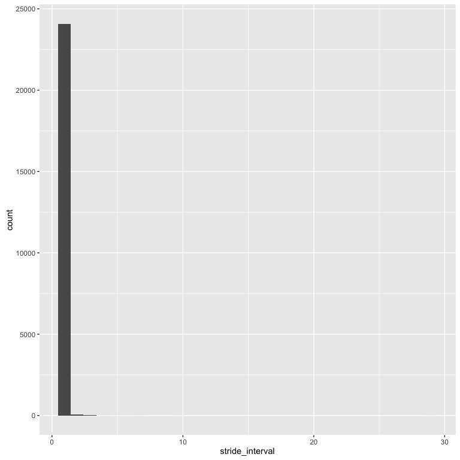

Exploratory Data Analysis
=========================

Visualization
-------------

### Session Info

    #> R version 3.2.3 (2015-12-10)
    #> Platform: x86_64-apple-darwin13.4.0 (64-bit)
    #> Running under: OS X 10.11.5 (El Capitan)
    #> 
    #> locale:
    #> [1] en_US.UTF-8/en_US.UTF-8/en_US.UTF-8/C/en_US.UTF-8/en_US.UTF-8
    #> 
    #> attached base packages:
    #> [1] stats     graphics  grDevices utils     datasets  methods   base     
    #> 
    #> other attached packages:
    #> [1] scales_0.4.0  ggplot2_2.1.0 dplyr_0.4.3   knitr_1.12   
    #> 
    #> loaded via a namespace (and not attached):
    #>  [1] Rcpp_0.12.5      digest_0.6.9     assertthat_0.1   plyr_1.8.4      
    #>  [5] grid_3.2.3       R6_2.1.2         gtable_0.2.0     DBI_0.3.1       
    #>  [9] formatR_1.2.1    magrittr_1.5     evaluate_0.8     stringi_1.1.1   
    #> [13] rmarkdown_0.8.1  labeling_0.3     tools_3.2.3      stringr_1.0.0   
    #> [17] munsell_0.4.3    yaml_2.1.13      parallel_3.2.3   colorspace_1.2-6
    #> [21] htmltools_0.2.6
